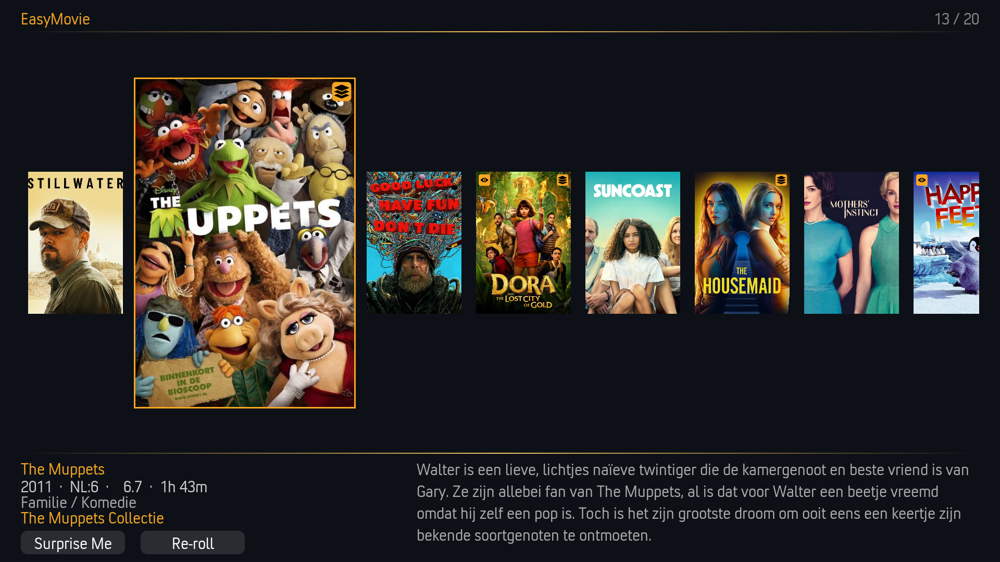
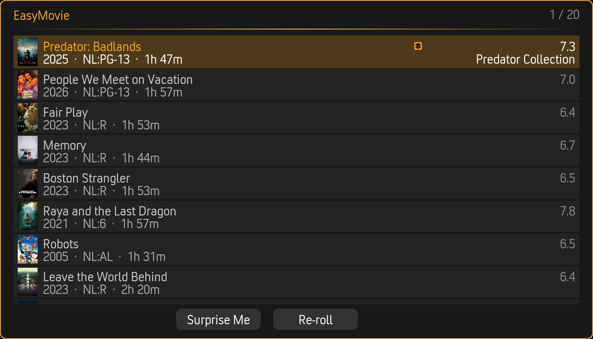
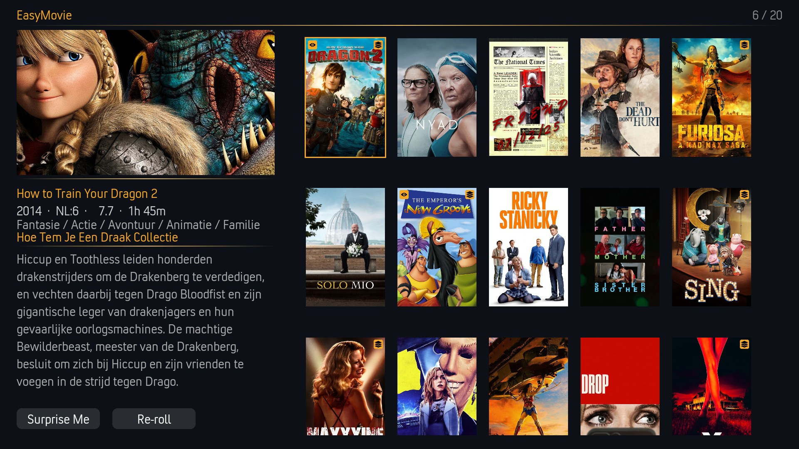
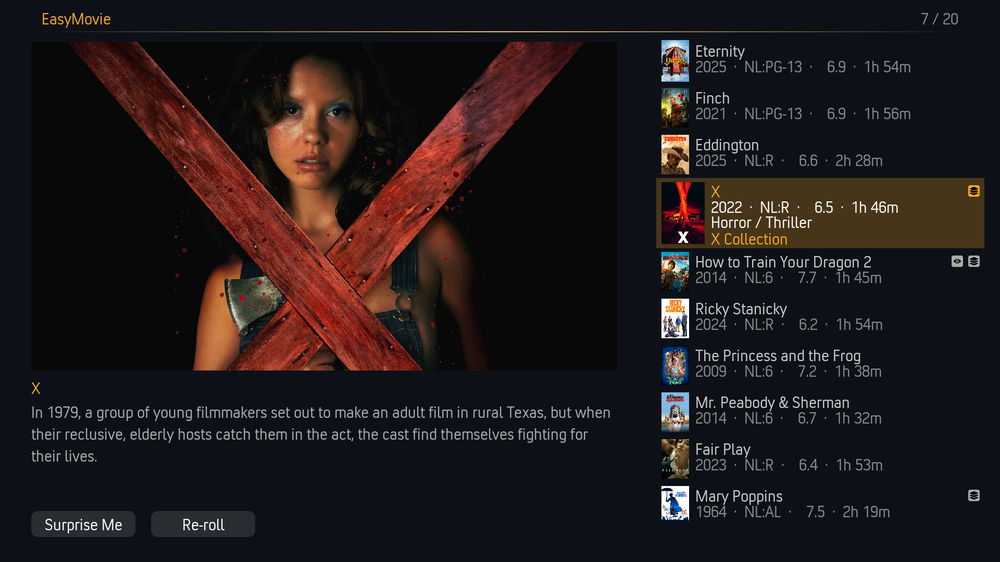
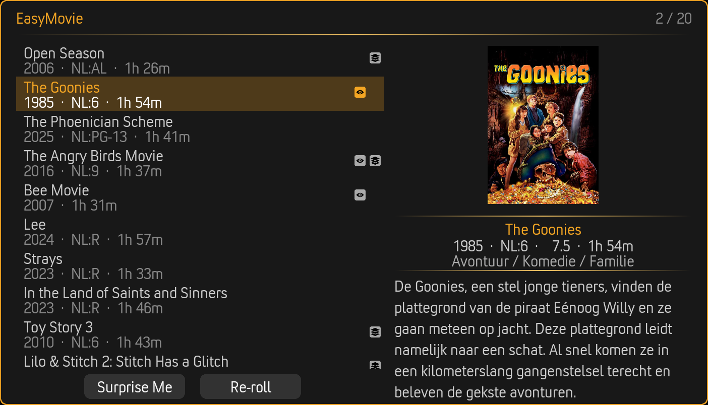
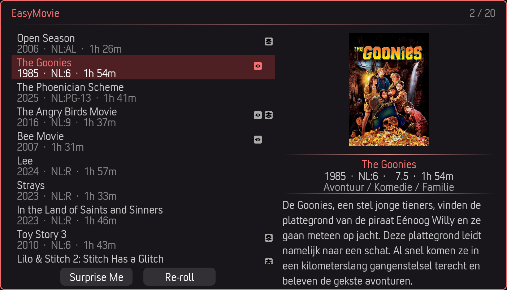
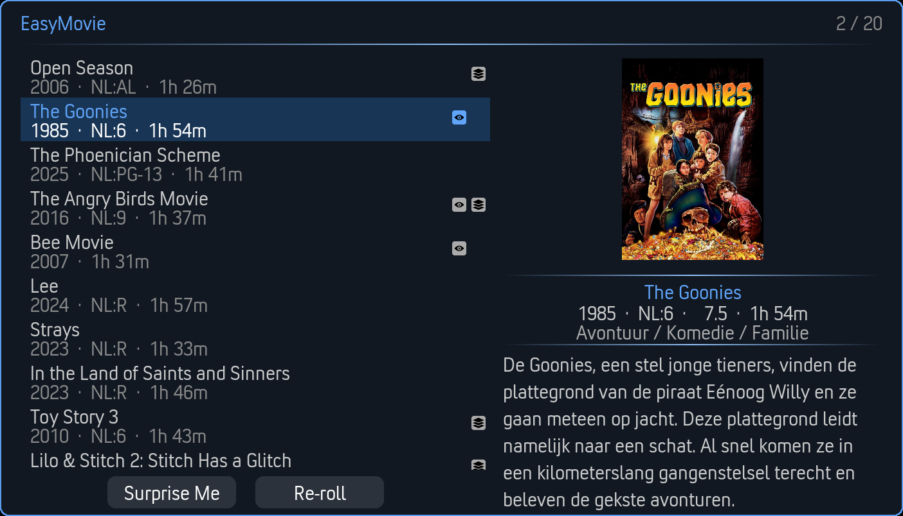

# Browse Mode

Browse Mode displays your filtered movie selection in a visual layout. You're in control — scan the results, pick what catches your eye, and start watching.

---

## How It Works

1. **Run through the [Filter Wizard](filter-wizard.md)** — Narrow your library by genre, rating, runtime, and more
2. **EasyMovie selects random matches** — A configurable number of movies (1–50) are pulled from the filtered pool
3. **Browse the results** — View them in your preferred layout
4. **Pick a movie** — Select one to start playing, or use Re-roll / Surprise Me

---

## View Styles

EasyMovie offers five visual layouts. Change via **Settings > Browse Mode > Appearance > View style**.

### Showcase (Default)

A horizontal filmstrip carousel with a large fanart backdrop. The focused movie fills the background with its artwork while details appear in the foreground.

Best for: Immersive browsing with a rich visual experience.

### Card List

Compact rows with poster thumbnail, title, year, rating, runtime, and set information. Data-dense and easy to scan.

Best for: Quick navigation with detailed information at a glance.

### Posters

A visual grid showing movie poster artwork. The focused movie displays details and plot summary.

Best for: Visual browsing, recognizing movies by artwork.

### Big Screen

Large poster artwork on the left with movie details and a scrollable list on the right. Optimized for 10-foot viewing from a distance.

Best for: Living room viewing from a couch, remote control navigation.

### Split View

Two-column layout: a compact movie list on the left and a detail panel on the right showing the focused movie's poster, rating, runtime, plot summary, and set information.

Best for: Balanced browsing with details always visible.

---

## Themes

All views and dialogs use your selected accent color theme. Change via **Settings > EasyMovie > Appearance > Theme**.

| Theme | Accent Color |
|-------|-------------|
| **Golden Hour** (default) | Warm orange/golden |
| **Ultraviolet** | Purple |
| **Ember** | Red |
| **Nightfall** | Blue |

| | |
|---|---|
|  |  |
|  |  |

> **Tip:** Press the **T** key (or the blue button on your remote) in Browse Mode to preview theme colors without changing settings.

---

## Actions

### Play

Select a movie and press Enter to start playback. If the movie is part of a collection and set awareness is enabled, EasyMovie may suggest an earlier unwatched movie instead (see [Movie Sets](movie-sets.md)).

### Surprise Me

Can't decide? **Surprise Me** picks a random movie from the current results and starts playing immediately.

### Re-roll

Not feeling any of the suggestions? **Re-roll** generates a fresh set of random results from the same filter criteria. The re-suggestion system ensures you don't see the same movies again too quickly.

### Play Full Set

When a movie belongs to a collection and set awareness is enabled, **Play Full Set** builds a playlist of all movies in the set and starts playing from the first unwatched one.

### Back

Returns to the filter wizard so you can adjust your criteria.

---

## Sorting Options

Control how results are ordered. Change via **Settings > Browse Mode > Results > Sort by**.

| Sort Method | Description |
|-------------|-------------|
| **Random** (default) | Shuffled order — different every time |
| **Title** | Alphabetical by movie title |
| **Year** | By release year |
| **Rating** | By user/community rating |
| **Runtime** | By movie length |
| **Date Added** | By when the movie was added to your library |

### Sort Direction

Choose **Ascending** or **Descending** via **Settings > Browse Mode > Results > Sort direction**.

---

## Result Count

Configure how many movies appear in the results. Change via **Settings > Browse Mode > Results > Number of movies**.

- Range: **1 to 50** movies
- Default: **10**

More movies means more choice but takes longer to browse. Fewer movies makes for a quicker decision.

---

## Return After Playback

By default, EasyMovie returns to the movie list after you finish watching. This lets you quickly pick your next movie.

**To disable:** Settings > Browse Mode > Appearance > **Return to EasyMovie after playback** > Off

When disabled, playback ends at your previous Kodi location (home screen, etc.).

---

## Movie Set Information

When [set awareness](movie-sets.md) is enabled, movies that belong to collections show their set name and position (e.g., "Movie 2 of 3 in The Lord of the Rings Collection").

**To show/hide:** Settings > Movie Sets > **Show set information**

---

## Related Pages

- **[Filter Wizard](filter-wizard.md)** — The filtering step before browsing
- **[Playlist Mode](playlist-mode.md)** — The other way to watch
- **[Movie Sets](movie-sets.md)** — How collections work in Browse Mode
- **[Settings Reference](settings-reference.md)** — All Browse Mode settings
