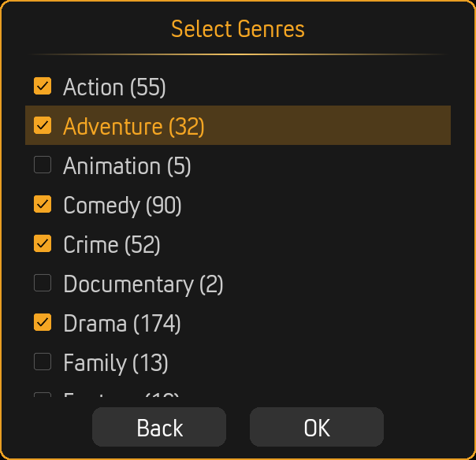
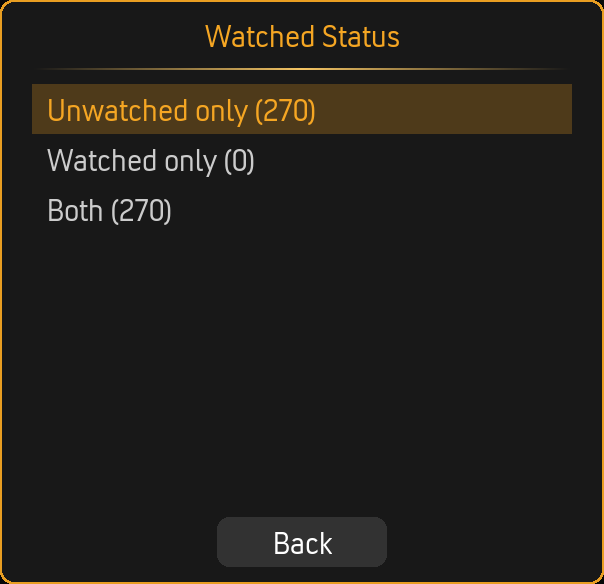
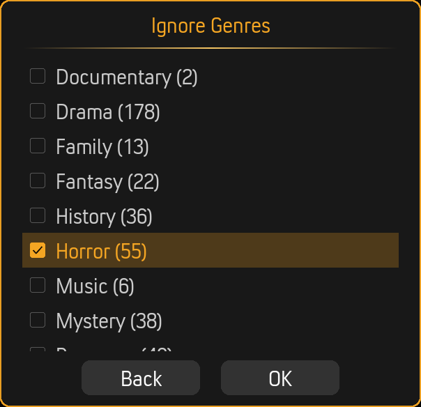
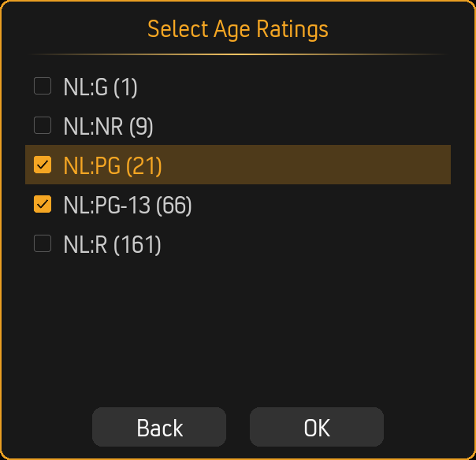
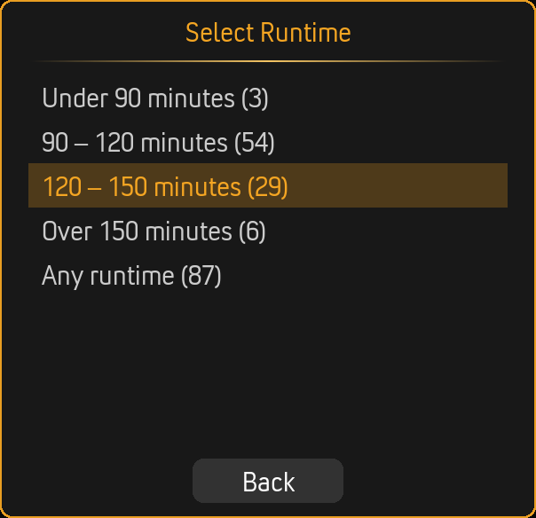
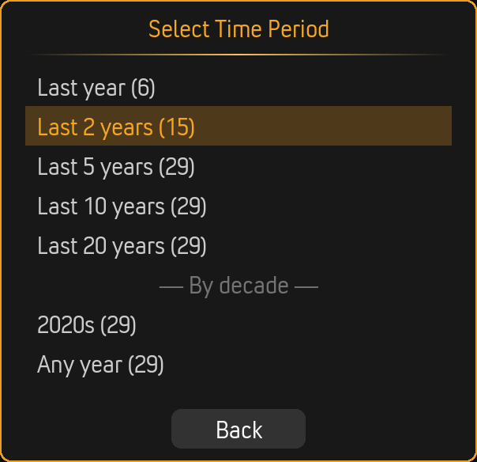
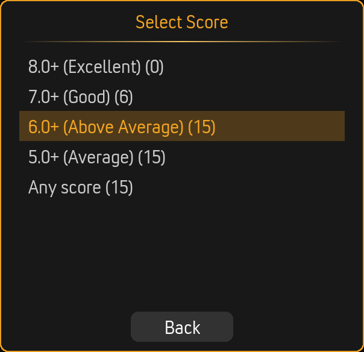

# Filter Wizard

The Filter Wizard is EasyMovie's signature feature. Instead of scrolling through your entire library, you answer a few quick questions and EasyMovie narrows down to movies that match your mood.

---

## How It Works

1. **Launch EasyMovie** - Choose Browse Mode or Playlist Mode
2. **Answer filter questions** - Each step narrows down the pool
3. **See your results** - A curated random selection from what matched

The wizard runs through up to seven filter steps. Each filter has three modes (configurable in **Settings > Filters**):

| Mode | Behavior |
|------|----------|
| **Ask** | Show a dialog each time - you choose in the moment |
| **Pre-set** | Use your saved values silently - no dialog shown |
| **Skip** | Ignore this filter entirely - all movies pass through |

Filters set to "Skip" or "Pre-set" don't interrupt the flow, so you can make the wizard as quick or detailed as you like.

---

## Filter Steps

### 1. Watched Status

Choose whether to include unwatched movies, watched movies, or both.

| Option | Description |
|--------|-------------|
| **Unwatched** | Only movies you haven't seen yet |
| **Watched** | Only movies you've already seen (rewatch night!) |
| **Both** | Everything in your library |

---

### 2. Ignore Genres

Select genres you want to **exclude** from results. Useful for permanently filtering out genres you never want (e.g., Horror for family movie night).

**Matching modes:**
- **Any selected (OR)** - Exclude movies matching *any* ignored genre
- **All selected (AND)** - Only exclude movies matching *all* ignored genres

---

### 3. Select Genres

Select genres you want to **include** in results.

**Matching modes:**
- **Any selected (OR)** - Include movies matching *any* selected genre (default)
- **All selected (AND)** - Only include movies matching *all* selected genres

> **Example:** Selecting "Action" and "Comedy" with OR matching returns action movies, comedies, *and* action-comedies. With AND matching, only action-comedies appear.

---

### 4. Age Ratings

Filter by MPAA/certification ratings. The dialog shows all ratings found in your library.

The available ratings come directly from your movie metadata - whatever ratings your library contains will appear here.

---

### 5. Runtime

Choose a runtime range. The wizard offers preset ranges for quick selection.

| Option | Range |
|--------|-------|
| Under 90 minutes | Short films and quick watches |
| 90 – 120 minutes | Standard movie length |
| 120 – 150 minutes | Longer features |
| Over 150 minutes | Epics and extended cuts |
| Any runtime | No filter |

In Pre-set mode, you can configure exact minimum and maximum values (0–300 minutes, in 5-minute steps).

---

### 6. Time Period

Filter by release year. The wizard offers recency options and decade browsing.

**Recency options:**
- Last year
- Last 2 years
- Last 5 years
- Last 10 years
- Last 20 years

**Decade browsing:** Select movies from specific decades (2020s, 2010s, 2000s, etc.)

**Any year:** No year filter

In Pre-set mode, you can configure: After year, Before year, Between years, or Less than X years ago.

---

### 7. Score

Set a minimum rating threshold.

| Option | Threshold |
|--------|-----------|
| 8.0+ (Excellent) | Only highly rated movies |
| 7.0+ (Good) | Well-reviewed movies |
| 6.0+ (Above Average) | Decent and above |
| 5.0+ (Average) | Most movies qualify |
| Any score | No filter |

Scores use a 0–100 scale internally (so 70 = 7.0 rating).

---

## Movie Counts

The wizard can show how many movies match each option, helping you make informed choices.

**Enable in:** Settings > Advanced > Filters > **Show movie counts in wizard**

### Cumulative Counts

When enabled, counts narrow as you progress through the wizard. After selecting "Action" in the genre step, the runtime step shows counts for action movies only - not your entire library.

**Enable in:** Settings > Advanced > Filters > **Cumulative counts**

> **Performance note:** Cumulative counting requires additional queries at each step. On low-power hardware, you may want to disable this for a snappier wizard experience.

---

## Remembering Answers

EasyMovie can pre-fill the wizard with your previous answers, so you can quickly repeat last night's choices or use them as a starting point.

**Enable in:** Settings > Advanced > Filters > **Remember last wizard answers**

---

## Navigation

- **Select an option** - Click or press Enter to choose
- **Back** - Go back to the previous step
- **Cancel** - Exit the wizard entirely

---

## Related Pages

- **[Browse Mode](browse-mode.md)** - What happens after the wizard in Browse Mode
- **[Playlist Mode](playlist-mode.md)** - What happens after the wizard in Playlist Mode
- **[Settings Reference](settings-reference.md)** - All filter settings explained
