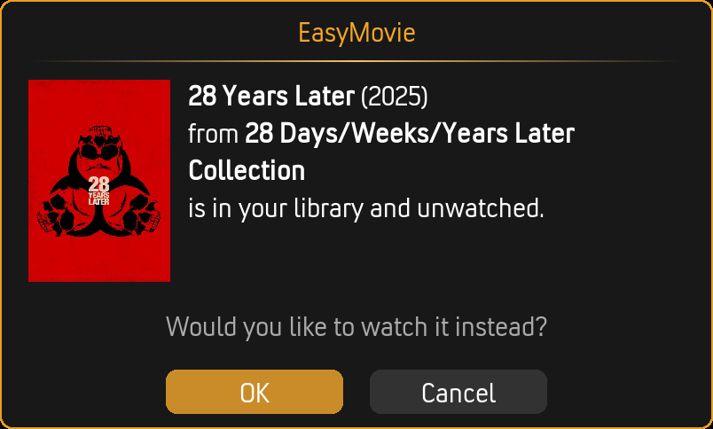

# Movie Sets

EasyMovie understands movie collections. When a movie belongs to a set (like *The Lord of the Rings* or *Harry Potter*), EasyMovie helps you watch them in order and continue through the collection.

---

## Set Awareness

When enabled, EasyMovie changes how it handles movies that belong to collections:

- Instead of suggesting a **random** movie from a set, EasyMovie suggests the **first unwatched** one
- If you've seen *The Fellowship of the Ring* and *The Two Towers*, EasyMovie suggests *The Return of the King*
- If you haven't seen any, it starts with the first movie

**Enable in:** Settings > Movie Sets > **Enable movie set awareness**

### What Counts as a Set?

EasyMovie uses Kodi's built-in movie set system. These are the "Collections" you see in your library — typically populated automatically by scrapers like TMDb or manually by you.

If a movie shows as part of a set in Kodi's library, EasyMovie will recognize it.

---

## Set Information

When browsing results, set movies display their collection name and position — for example, "Movie 2 of 3 in The Lord of the Rings Collection".

**Enable in:** Settings > Movie Sets > **Show set information**

This appears in all view styles (Showcase, Card List, Posters, Big Screen, Split View).

---

## Set Continuation

After finishing a collection movie, EasyMovie can prompt you to watch the next one in the set.

### How It Works

1. You finish watching a movie that belongs to a collection
2. EasyMovie checks if there's a next unwatched movie in the set
3. A prompt appears showing the next movie with a countdown timer
4. Choose **Watch Next** to continue the set, or **Skip** to return

### Countdown Timer

The countdown gives you time to decide without requiring immediate input.

| Setting | Options | Default |
|---------|---------|---------|
| **Countdown duration** | 5–60 seconds (step 5) | 20 seconds |
| **If countdown expires** | Continue set / Continue playlist | Continue set |

**Continue set:** When the timer runs out, the next collection movie starts playing automatically.

**Continue playlist:** When the timer runs out, the existing playlist resumes instead (useful in Playlist Mode).

### When Does Continuation Appear?

The prompt only appears when:
- Set awareness is enabled
- Continuation prompts are enabled
- The movie you just finished belongs to a collection
- There's at least one more unwatched movie in the collection

**Enable in:** Settings > Movie Sets > **Enable continuation prompts**

---

## Earlier Movie Warnings

If you're about to watch a movie but there's an earlier unwatched movie in the same set, EasyMovie warns you.

### Example

You select *The Dark Knight Rises* (movie 3 of 3 in The Dark Knight Trilogy), but *The Dark Knight* (movie 2) is unwatched. EasyMovie shows:

> "*The Dark Knight* from *The Dark Knight Trilogy* is in your library and unwatched. Would you like to watch it instead?"

You can choose to watch the earlier movie or continue with your original selection.

**Enable in:** Settings > Playback > Warnings > **Warn about earlier unwatched movies in set**

---

## Settings Summary

| Setting | Location | Options | Default |
|---------|----------|---------|---------|
| **Enable movie set awareness** | Movie Sets > Set Awareness | On / Off | On |
| **Show set information** | Movie Sets > Set Awareness | On / Off | On |
| **Enable continuation prompts** | Movie Sets > Continuation | On / Off | On |
| **Countdown duration (seconds)** | Movie Sets > Continuation | 5–60 | 20 |
| **If countdown expires** | Movie Sets > Continuation | Continue set / Continue playlist | Continue set |
| **Warn about earlier unwatched movies** | Playback > Warnings | On / Off | On |

### Visibility Rules

- "Show set information" only appears when set awareness is enabled
- "Enable continuation prompts" only appears when set awareness is enabled
- "Countdown duration" and "If countdown expires" only appear when both set awareness and continuation prompts are enabled

---

## Tips

- **Not all movies need sets.** Set awareness only affects movies that Kodi recognizes as part of a collection. Standalone movies are unaffected.
- **Missing movies still work.** If your library has movies 1 and 3 but not 2, EasyMovie suggests movie 3 after you watch movie 1 (it works with what's available).
- **Sets work in both modes.** Set awareness, continuation, and warnings work in both Browse Mode and Playlist Mode.

---

## Related Pages

- **[Browse Mode](browse-mode.md)** — How sets appear in browse results
- **[Playlist Mode](playlist-mode.md)** — Set continuation during playlists
- **[Settings Reference](settings-reference.md)** — All Movie Sets settings
