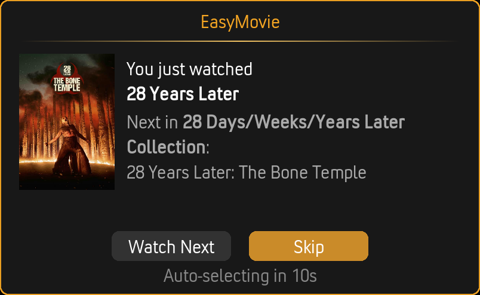

# Playlist Mode

Playlist Mode builds a movie marathon from your filtered selection. Instead of browsing and picking, EasyMovie creates a playlist and starts playing immediately.

---

## How It Works

1. **Run through the [Filter Wizard](filter-wizard.md)** — Same filters as Browse Mode
2. **EasyMovie selects movies** — Based on your filters and playlist settings
3. **Playback starts** — The playlist begins automatically

No browsing, no deciding — just movies.

---

## Settings

### Basics

| Setting | Options | Default | Description |
|---------|---------|---------|-------------|
| **Number of movies** | 1–20 | 5 | How many movies in the playlist |
| **Sort by** | Random / Title / Year / Rating / Runtime / Date Added | Random | Playlist order |
| **Sort direction** | Ascending / Descending | Descending | Sort order |

### Playback

| Setting | Options | Default | Description |
|---------|---------|---------|-------------|
| **Start playlist with unfinished movies** | On / Off | On | Partially watched movies play first |
| **Seek to resume point for movies** | On / Off | On | Auto-skip to where you left off |

**Start with unfinished movies:** If you have a movie that's 45 minutes in, it gets placed at the front of the playlist so you can finish it first.

**Seek to resume point:** EasyMovie automatically jumps to where you stopped watching (10 seconds before your last position, so you have context).

---

## Set Continuation in Playlists

When a movie from a collection finishes playing and [continuation prompts](movie-sets.md) are enabled, EasyMovie offers to play the next movie in the set.

### How It Works

1. You finish watching *The Fellowship of the Ring*
2. EasyMovie detects it's part of *The Lord of the Rings* collection
3. A prompt appears: "Watch *The Two Towers* next?"
4. A countdown timer shows the remaining time
5. Choose **Watch Next** or **Skip**

### Countdown Behavior

| Setting | Description |
|---------|-------------|
| **Countdown duration** | 5–60 seconds before auto-action |
| **If countdown expires** | Continue set (play next movie) or Continue playlist (resume the playlist) |

---

## Playback Notifications

When each movie starts playing, EasyMovie can show a notification with the title and details.

**Enable in:** Settings > Playback > During Playback > **Show info when playing**

---

## In-Progress Check

When you launch EasyMovie, it can check if you have a partially watched movie and offer to resume it before starting the wizard.

**Enable in:** Settings > Playback > On Launch > **Check for in-progress movie on launch**

---

## Related Pages

- **[Filter Wizard](filter-wizard.md)** — The filtering step before playlist generation
- **[Browse Mode](browse-mode.md)** — The other way to watch
- **[Movie Sets](movie-sets.md)** — Set continuation during playlists
- **[Settings Reference](settings-reference.md)** — All Playlist Mode settings
